# Setup

Note, the classification analyses here (Figure 1 Example 1 and for Supplemental Figure 1) create very large matrices that can exceed default limits for R pointer size and the C stack limit on some systems.  If you see `Error: protect(): protection stack overflow` or `Error: segfault from C stack overflow`, one of these is the issue. From GNU/Linux, these limits can be increased from the command-line as follows:

```
ulimit -s 65535   #addresses C stack overflow
R --vanilla --max-ppsize=500000    #addresses protect() error
```

If you are running on a machine with limited memory, a 32-bit installation of R, otherwise have trouble with stack overflows, or you do not want to run these classification examples, change `eval=TRUE` to `eval=FALSE` in the chunk options for the chunks named `fig1eg` and `suppfig1` to skip these analyses.

Note, when running Supplemental Figure 5 a warning occurs that "The data you have provided does not have any singletons." This is because the estimated relative abundance output of MetaPhlAn2 (and other metagenomic profiling software), even when converted to approximate counts by multiplying by read depth, does not include singletons. It is not a result of trimming, and does not affect the validity of the calculated Shannon diversity measure in as much as any relative abundance data, such as microbiome data from metagenomics, can be used to estimate alpha diversity. However, we recommend that the chao1 diversity measure not be used (Haegeman et al, The ISME Journal (2013) 7, 1092–1101; doi:10.1038/ismej.2013.10).

Then enter the following from within R to build the html:

```r
library(rmarkdown)
rmarkdown::render("PaperFigures.Rmd", "html_document")
```

# Run

```r
suppressPackageStartupMessages({
    library(curatedMetagenomicData)
    library(phyloseq)
    library(randomForest)
    library(caret)
    library(pROC)
    library(gclus)
    library(doMC)
    library(stats)
    library(cluster)
    library(fpc)
    library(reshape2)
})
```

Set the number of cores to use:

```r
registerDoMC(32)
```

# Coordinated Color Scheme


```r
blue <- "#3366aa"
blueGreen <- "#11aa99"
green <- "#66aa55"
paleYellow <- "#cccc55"
gray <- "#e5e5e5"
purple <- "#992288"
red <- "#ee3333"
orange <- "#ee7722"
yellow <- "#ffee33"
darkGray <- "#b3b3b3"
brown <- "#655643"
lightBlack <- "#777777"
black <- "#000000"
pallet <- c(blue, blueGreen, green, paleYellow, gray, purple, red,
            orange, yellow, darkGray, brown, lightBlack, black)
pallet_reduced <- c(blue, green, darkGray, purple, red, black)
n <- length(pallet)
image(1:n, 1, as.matrix(1:n), col = pallet, xlab = "", ylab = "", xaxt = "n", 
      yaxt = "n", bty = "n")
```


# Figure 1, Example 1: Classification

```r
dataset_list <-
    c(  "KarlssonFH_2013 (T2D)",
        "LeChatelierE_2013 (Obesity)",
        "NielsenHB_2014 (IBD)",
        "QinJ_2012 (T2D)",
        "QinN_2014 (Cirrhosis)",
        "ZellerG_2014 (CRC)"
     )
class_list <- c("T2D", "obesity", "IBD", "T2D", "cirrhosis", "CRC")
data_list <- matrix(nrow = 5, ncol = length(dataset_list))
## update
data_list[1, ] <- c("EH439", "EH547", "EH457", "EH475", "EH541", "EH535")  # Species abundance
data_list[2, ] <- c("EH440", "EH548", "EH458", "EH476", "EH542", "EH536")  # Pathway abundance
data_list[3, ] <- c("EH441", "EH549", "EH459", "EH477", "EH543", "EH537")  # Pathway coverage
data_list[4, ] <- c("EH437", "EH545", "EH455", "EH473", "EH539", "EH533")  # Marker abundance
data_list[5, ] <- c("EH438", "EH546", "EH456", "EH474", "EH540", "EH534")  # Marker presencee

## update
eh <- ExperimentHub()

set.seed(0);

for (j in 1:length(data_list[, 1])) {
  for (i in 1:length(dataset_list)) {
    filename <- paste0(paste("rf", j, i, sep = "_"), ".rds")
    message(paste("Training:", j, i, dataset_list[i]))
    if(file.exists(filename)) next
    taxabund <- eh[[data_list[j, i]]]
    
    feat <- t(exprs(taxabund))
    if (j == 1) {
      feat <- feat[, grepl("(s__|unclassified)", colnames(feat))]
      feat <- feat[, !grepl("t__", colnames(feat))]
    }
    if (j <= 3) {
      feat <- predict(preProcess(feat, method=c("zv", "scale", "center")), feat) 
    } else {
      feat <- predict(preProcess(feat, method=c("nzv", "scale", "center"), freqCut = 75/25, uniqueCut = 100), feat)
    }

    meta <- pData(taxabund)
    if (i == 2) {
        meta$study_condition[meta$BMI <= 25] = "lean"
        meta$study_condition[meta$BMI >= 30] = "obesity"
    }
    if (i == 6) {
        meta$study_condition[meta$disease_subtype == "smalladenoma"] = "control"
    }
    meta <- meta["study_condition"]
    all <- cbind(feat, meta)
    if (i == 1) {
        all <- subset(all, study_condition != "IGT")
    }
    if (i == 2) {
        all <- subset(all, study_condition != "control")
    }
    if (i == 4) {
        all <- subset(all, !is.na(study_condition))
    }
    if (i == 6) {
        all <- subset(all, study_condition != "adenoma")
    }

    object <- 
      train(
        study_condition ~ .,
        data = all,
        method = "rf",
        ntree = 500,
        #tuneGrid = expand.grid(.mtry = c(10, 20, 30, 40, 50, 60, 70, 80, 90, 100, 125, 150, 175, 200, 300, 400, 500)),
        tuneGrid = expand.grid(.mtry = c(50)),
        trControl = trainControl(
          method = "repeatedcv",
          number = 10,
          search = "grid",
          summaryFunction = twoClassSummary,
          classProbs = TRUE,
          savePredictions = TRUE
        )
      )
    saveRDS(object, file=filename)
  }
}

message("Finished training, starting plotting.")

ci_bugs <- c()
ci_pab <- c()
ci_pcov <- c()
ci_mab <- c()
ci_mpr <- c()

for (i in 1:length(dataset_list)) {
  message(paste(i, ":", dataset_list[i]))
  rf <- readRDS(paste0(paste("rf", 1, i, sep = "_"), ".rds"))
  ci_bugs <- c(ci_bugs, auc(rf$pred$obs[rf$pred$mtry == rf$bestTune$mtry], rf$pred[, class_list[i]][rf$pred$mtry == rf$bestTune$mtry]))
  
  rf <- readRDS(paste0(paste("rf", 2, i, sep = "_"), ".rds"))
  ci_pab <- c(ci_pab, auc(rf$pred$obs[rf$pred$mtry == rf$bestTune$mtry], rf$pred[, class_list[i]][rf$pred$mtry == rf$bestTune$mtry]))
  
  rf <- readRDS(paste0(paste("rf", 3, i, sep = "_"), ".rds"))
  ci_pcov <- c(ci_pcov, auc(rf$pred$obs[rf$pred$mtry == rf$bestTune$mtry], rf$pred[, class_list[i]][rf$pred$mtry == rf$bestTune$mtry]))
  
  rf <- readRDS(paste0(paste("rf", 4, i, sep = "_"), ".rds"))
  ci_mab <- c(ci_mab, auc(rf$pred$obs[rf$pred$mtry == rf$bestTune$mtry], rf$pred[, class_list[i]][rf$pred$mtry == rf$bestTune$mtry]))
  
  rf <- readRDS(paste0(paste("rf", 5, i, sep = "_"), ".rds"))
  ci_mpr <- c(ci_mpr, auc(rf$pred$obs[rf$pred$mtry == rf$bestTune$mtry], rf$pred[, class_list[i]][rf$pred$mtry == rf$bestTune$mtry]))
}

ci <- data.frame(ci_bugs, ci_pab, ci_pcov, ci_mab, ci_mpr)
colnames(ci) <-
  c(
    "Species abundance",
    "Pathway abundance",
    "Pathway coverage",
    "Marker abundance",
    "Marker presence"
  )
ci.r <- abs(cor(ci))
ci.col <- dmat.color(ci.r)
ci.o <- order.single(ci.r)

par(oma = c(4, 1, 1, 1))

cpairs(
  ci,
  ci.o,
  panel.colors = ci.col,
  col = alpha(pallet_reduced, 0.75),
  pch = 16,
  cex = 2,
  gap = 0.5,
  main = "AUC"
)

par(
  fig = c(0, 1, 0, 1),
  oma = c(0, 0, 0, 0),
  mar = c(0, 0, 0, 0),
  new = TRUE
)
plot(0, 0, type = "n", bty = "n", xaxt = "n", yaxt = "n")
legend("bottom", xpd = TRUE, inset = c(0, 0), bty = "n", pch = 16, cex = 0.6, ncol=3, dataset_list, col = pallet_reduced)
```

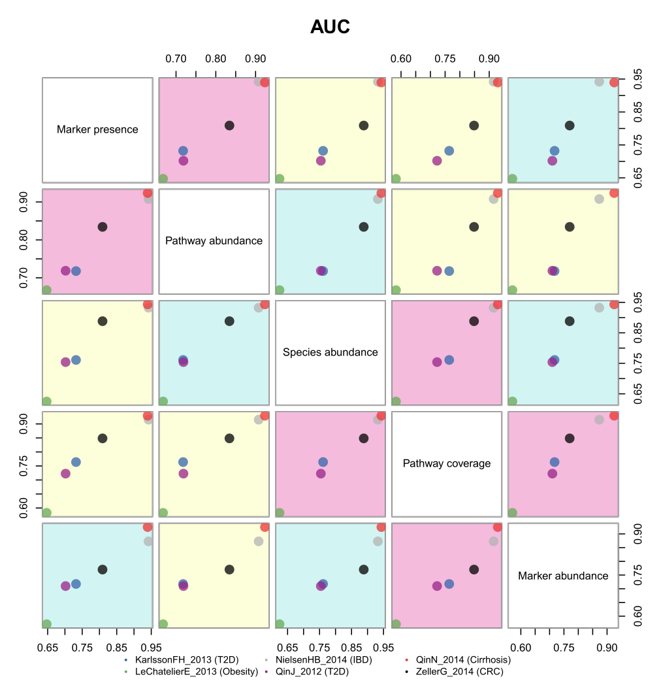

# Figure 1, Example 2: Clustering


```r
joinWithRnames <- function(obj, FUN = I) {
    mylist <- lapply(obj, function(x) {
        df <- data.frame(FUN(x))
        df$rnames28591436107 <- rownames(df)
        return(df)
    })
    bigdf <- Reduce(full_join, mylist)
    rownames(bigdf) <- make.names(bigdf$rnames28591436107)
    bigdf <- bigdf[, !grepl("^rnames28591436107$", colnames(bigdf))]
    return(bigdf)
}
## update
source("https://raw.githubusercontent.com/waldronlab/presentations/master/Waldron_2016-06-07_EPIC/metaphlanToPhyloseq.R")

## update
eh <- ExperimentHub()
myquery <- query(eh, "curatedMetagenomicData")
version <- "20170526."

myquery.stool <- myquery[grepl("stool", myquery$title) & grepl("bugs", myquery$title) & grepl(version, myquery$title) & !grepl("VatanenT_2016", myquery$title) & !grepl("AsnicarF_2017", myquery$title), ]

eset.list <- lapply(names(myquery.stool), function(x) myquery.stool[[x]])

names(eset.list) <- gsub("-", "_", gsub(version, "", myquery.stool$title))

for (i in 1:length(eset.list)) {
    colnames(eset.list[[i]]) <- paste(names(eset.list)[[i]], colnames(eset.list[[i]]), sep = ".")
    pData(eset.list[[i]]) <- pData(eset.list[[i]])[, !sapply(pData(eset.list[[i]]), function(x) all(is.na(x)))]
    eset.list[[i]]$subjectID <- as.character(eset.list[[i]]$subjectID)
}

for (i in seq_along(eset.list)) {
    eset.list[[i]] <- eset.list[[i]][grep("t__", rownames(eset.list[[i]]), invert = TRUE), ]
    eset.list[[i]] <- eset.list[[i]][grep("s__|_unclassified", rownames(eset.list[[i]]), perl = TRUE), ]
}

pdat <- joinWithRnames(eset.list, FUN = pData)
pdat$study <- sub("\\..+", "", rownames(pdat))
ab <- joinWithRnames(eset.list, FUN = exprs)
ab[is.na(ab)] <- 0
eset <- ExpressionSet(assayData = as.matrix(ab), phenoData = AnnotatedDataFrame(pdat))

## update
pseq <- metaphlanToPhyloseq(tax = exprs(eset), metadat = pData(eset), split = ".")

samp <- data.frame(sample_data(pseq))

dist_bray <- distance(pseq, method = "bray")

ord_bray <- ordinate(pseq, method = "PCoA", distance = dist_bray)

samp$bray_cluster_2 <- factor(pam(dist_bray, k = 2, cluster.only = TRUE))
sample_data(pseq) <- samp

Prev <- as.numeric(otu_table(pseq)["s__Prevotella_copri", ])
samp$Prevotella_copri <- Prev
sample_data(pseq) <- samp

pc1 <- ord_bray$vectors[, 1]
pc2 <- ord_bray$vectors[, 2]

otu_tax <- attr(otu_table(pseq), "dimnames")[[1]]
otu_bacteroides <- otu_table(pseq)[grep("s__Bacteroides", otu_tax), ]
sum_bacteroides <- apply(otu_bacteroides, 2, sum)

df_ordinate <- data.frame(pc1, pc2, bact = sum_bacteroides, prev = Prev, bray2 = as.numeric(samp$bray_cluster_2) + 20)
df_bact <- df_ordinate[df_ordinate$bray2 == 22, ]
df_prev <- df_ordinate[df_ordinate$bray2 == 21, ]

ggplot() +
    geom_point(data = df_prev, aes(x = pc1, y = pc2, shape = factor(bray2), fill = prev), shape = 21, size = 4) +
    scale_fill_gradient(low = "white", high = purple, guide = guide_colorbar(direction = "horizontal", title = "Prevotella copri \n(cluster 2)")) +
    geom_point(data = df_bact, aes(x = pc1, y = pc2, shape = factor(bray2), color = bact), shape = 22, size = 4) +
    scale_color_gradient(low = lightBlack, high = blueGreen, guide = guide_colorbar(direction = "horizontal", title = "Bacteroides \n(cluster 1)")) +
    labs(x = "Axis 1", y = "Axis 2", title = "PCoA on species abundance, displaying 2 clusters") +
    theme(axis.ticks = element_blank(), axis.text = element_blank(), legend.box = "vertical", legend.position = c(0.775, 0.125), plot.title = element_text(hjust = 0.5))
```

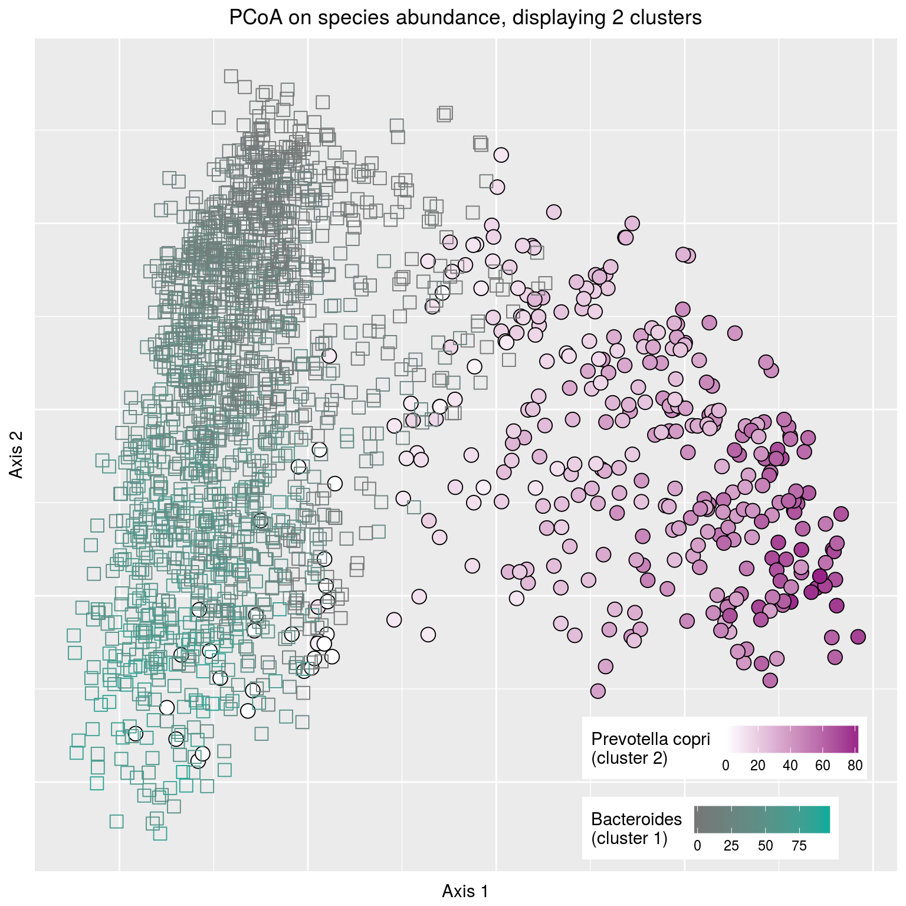

# Figure 1, Example 3: Abundance across samples

```r
## update
eh <- ExperimentHub()
myquery <- query(eh, "curatedMetagenomicData")
version <- "20170526."

myquery.stool <- myquery[grepl("stool", myquery$title) & grepl("bugs", myquery$title) & grepl(version, myquery$title) & !grepl("VatanenT_2016", myquery$title) & !grepl("AsnicarF_2017", myquery$title), ]

eset.list <- lapply(names(myquery.stool), function(x) myquery.stool[[x]])

names(eset.list) <- gsub("-", "_", gsub(version, "", myquery.stool$title))

for (i in 1:length(eset.list)) {
    colnames(eset.list[[i]]) <- paste(names(eset.list)[[i]], colnames(eset.list[[i]]), sep = ".")
    pData(eset.list[[i]]) <- pData(eset.list[[i]])[,!sapply(pData(eset.list[[i]]), function(x) all(is.na(x)))]
    eset.list[[i]]$subjectID <- as.character(eset.list[[i]]$subjectID)
}

for (i in seq_along(eset.list)) {
    eset.list[[i]] <- eset.list[[i]][grep("t__", rownames(eset.list[[i]]), invert = TRUE),]
    eset.list[[i]] <- eset.list[[i]][grep("s__|_unclassified", rownames(eset.list[[i]]), perl = TRUE),]
}

pdat <- joinWithRnames(eset.list, FUN = pData)
pdat$study <- sub("\\..+", "", rownames(pdat))
ab <- joinWithRnames(eset.list, FUN = exprs)
ab[is.na(ab)] <- 0
eset_bugs <- ExpressionSet(assayData = as.matrix(ab), phenoData = AnnotatedDataFrame(pdat))

## update
pseq <- metaphlanToPhyloseq(tax = exprs(eset_bugs), metadat = pData(eset_bugs), split = ".")

glom <- tax_glom(pseq, taxrank = "Phylum")

top8phyla <- names(sort(taxa_sums(glom), TRUE)[1:8])
phyla8_subset <- prune_taxa(top8phyla, glom)

phyla_to_sort <-
    data.frame(
        id = 1:8,
        phyla = as.character(tax_table(phyla8_subset)[, "Phylum"]),
        otu = as.character(taxa_names(phyla8_subset))
    )
rownames(phyla_to_sort) <- phyla_to_sort$otu

phylum_ranks <-
    phyla8_subset %>%
    otu_table %>%
    rowSums %>%
    sort(TRUE) %>%
    names

phyla_to_sort <- phyla_to_sort[phylum_ranks, ]

prop <- transform_sample_counts(phyla8_subset, function(i) i/sum(i))

bardat <-
    psmelt(prop) %>%
    select(OTU, Sample, Abundance) %>%
    mutate(Sample = as.numeric(factor(Sample)), OTU = factor(OTU, levels = phyla_to_sort$otu, labels = phyla_to_sort$phyla))

firmicutes_order <-
    bardat %>%
    filter(OTU == "Firmicutes") %>%
    arrange(Abundance) %>%
    select(Sample)

bardat %<>%
    mutate(Sample = as.numeric(factor(Sample, levels = factor(firmicutes_order$Sample)))) %>%
    arrange(desc(OTU), Abundance)

set.seed(14)

bardat %>%
    ggplot(aes(x = Sample, y = Abundance, fill = OTU)) +
    geom_area() +
    scale_fill_manual(values = sample(c(blue, yellow, green, gray, purple, 
                                        red, orange, paleYellow), 
                                      size = 8, replace = FALSE), 
                      guide = guide_legend(nrow = 4, ncol = 2)) +
    theme(axis.text.x = element_blank(), axis.title.x = element_blank(), axis.ticks.x = element_blank(), legend.position = c(0.7, 0.7), legend.direction = "vertical", legend.title = element_blank(), panel.background = element_blank())
```

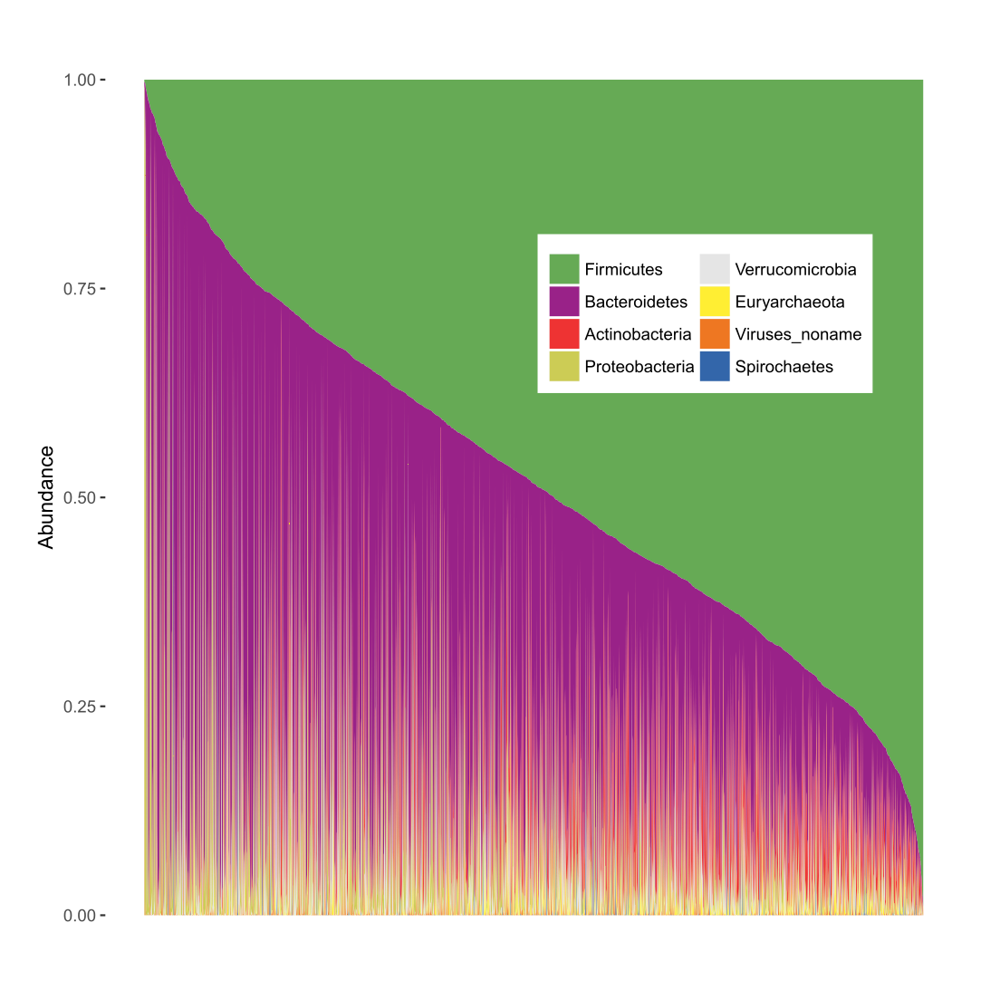

# Figure 1, Example 4: Species-pathway correlation


```r
## update
eh <- ExperimentHub()
myquery <- query(eh, "curatedMetagenomicData")
version <- "20170526."

myquery.stool <- myquery[grepl("stool", myquery$title) & grepl("pathabundance", myquery$title) & grepl(version, myquery$title) & !grepl("VatanenT_2016", myquery$title) & !grepl("AsnicarF_2017", myquery$title), ]

eset.list <- lapply(names(myquery.stool), function(x) myquery.stool[[x]])

names(eset.list) <- gsub("-", "_", gsub(version, "", myquery.stool$title))

for (i in 1:length(eset.list)) {
    colnames(eset.list[[i]]) <- paste(names(eset.list)[[i]], colnames(eset.list[[i]]), sep = ".")
    pData(eset.list[[i]]) <- pData(eset.list[[i]])[, !sapply(pData(eset.list[[i]]), function(x) all(is.na(x)))]
    eset.list[[i]]$subjectID <- as.character(eset.list[[i]]$subjectID)
}

for (i in seq_along(eset.list)) {
    eset.list[[i]] <- eset.list[[i]][!grepl("\\|", rownames(eset.list[[i]])), ]
}

pdat <- joinWithRnames(eset.list, FUN = pData)
pdat$study <- sub("\\..+", "", rownames(pdat))
ab <- joinWithRnames(eset.list, FUN = exprs)
ab[is.na(ab)] <- 0
eset_pathway <- ExpressionSet(assayData = as.matrix(ab), phenoData = AnnotatedDataFrame(pdat))

eset_pathway$prev <- as.numeric(exprs(eset_bugs)[grep("s__Prevotella_copri", rownames(exprs(eset_bugs))), ])

cor_est_p <- function(x1, x2) {
    cor <- cor.test(x1, x2)
    c(r = cor$estimate, p = cor$p.value)
}

cors <- t(sapply(featureNames(eset_pathway), function(i) cor_est_p(exprs(eset_pathway)[i, ], eset_pathway$prev)))

feature <- rownames(cors)

cors <- as.data.frame(cors)
cors$feature <- feature
cors <- na.omit(cors)

par(mar = c(10, 10, 10, 10))
qplot(
    x = eset_pathway$prev,
    y = exprs(eset_pathway)[cors$feature[cors$r.cor == max(cors$r.cor)],],
    xlab = "Prevotella copri abundance",
    ylab = "Pathway abundance",
    main = "Inosine 5 phosphate biosynthesis ",
    colour = I(black),
    shape = I(1)
) +
    theme(plot.title = element_text(hjust = 0.5))
```

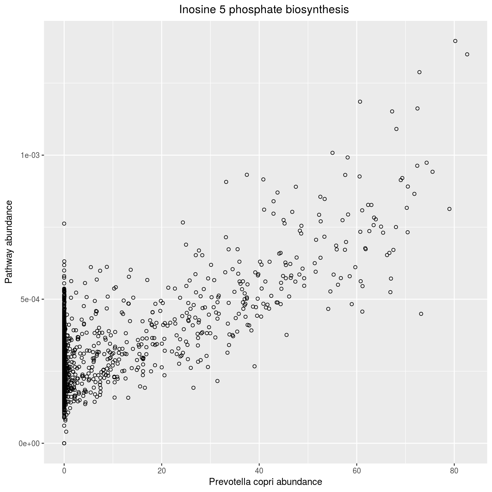

# Supplemental Figure 1: Health status classification from species abundance


```r
dataset_list <-
    c(  "KarlssonFH_2013 (T2D)",
        "LeChatelierE_2013 (Obesity)",
        "NielsenHB_2014 (IBD)",
        "QinJ_2012 (T2D)",
        "QinN_2014 (Cirrhosis)",
        "ZellerG_2014 (CRC)"
      )
class_list <- c("T2D", "obesity", "IBD", "T2D", "cirrhosis", "CRC")
## update
data_list <- c("EH439", "EH547", "EH457", "EH475", "EH541", "EH535")

## update
eh <- ExperimentHub()

set.seed(0);

for (i in 1:length(dataset_list)) {
    taxabund <- eh[[data_list[i]]]
    
    feat <- t(exprs(taxabund))
    feat <- feat[, grep("(s__|unclassified)", colnames(feat))]
    feat <- feat[, -grep("t__", colnames(feat))]

    meta <- pData(taxabund)
    if (i == 2) {
        meta$study_condition[meta$BMI <= 25] = "lean"
        meta$study_condition[meta$BMI >= 30] = "obesity"
    }
    if (i == 6) {
        meta$study_condition[meta$disease_subtype == "smalladenoma"] = "control"
    }
    meta <- meta["study_condition"]
    all <- cbind(feat, meta)
    if (i == 1) {
        all <- subset(all, study_condition != "IGT")
    }
    if (i == 2) {
        all <- subset(all, study_condition != "control")
    }
    if (i == 4) {
        all <- subset(all, !is.na(study_condition))
    }
    if (i == 6) {
        all <- subset(all, study_condition != "adenoma")
    }
    
    assign(
        paste("rf", i, sep = "_"),
        train(
            study_condition ~ .,
            data = all,
            preProc = c("zv", "scale", "center"),
            method = "rf",
            ntree = 500,
            #tuneGrid = expand.grid(.mtry = c(10, 20, 30, 40, 50, 60, 70, 80, 90, 100, 125, 150, 175, 200, 300, 400, 500)),
            tuneGrid = expand.grid(.mtry = c(50)),
            trControl = trainControl(
                method = "repeatedcv",
                number = 10,
                search = "grid",
                summaryFunction = twoClassSummary,
                classProbs = TRUE,
                savePredictions = TRUE
            )
        )
    )
}

for (i in 1:length(dataset_list)) {
    rf <- get(paste("rf", i, sep = "_"))
    
    if (i == 1) {
        plot.roc(
            rf$pred$obs[rf$pred$mtry == rf$bestTune$mtry],
            rf$pred[, class_list[i]][rf$pred$mtry == rf$bestTune$mtry],
            grid = TRUE,
            ci = TRUE,
            xaxs = "i",
            yaxs = "i",
            col = pallet_reduced[i],
            lty = 1
        )
    } else {
        plot.roc(
            rf$pred$obs[rf$pred$mtry == rf$bestTune$mtry],
            rf$pred[, class_list[i]][rf$pred$mtry == rf$bestTune$mtry],
            grid = TRUE,
            ci = TRUE,
            xaxs = "i",
            yaxs = "i",
            col = pallet_reduced[i],
            lty = 1,
            add = TRUE
        )
    }
}

legend(
    "bottomright",
    box.lwd = 0,
    box.col = "transparent",
    bg = "transparent",
    lwd = 2,
    legend = dataset_list,
    col = pallet_reduced    
)
```

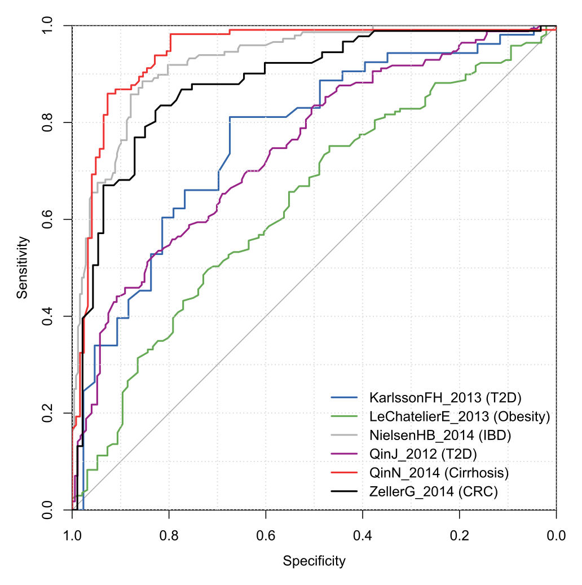

# Supplemental Figure 2: Clustering colored by study and disease states


```r
## update
eh <- ExperimentHub()
myquery <- query(eh, "curatedMetagenomicData")
version <- "20170526."

myquery.stool <- myquery[grepl("stool", myquery$title) & grepl("bugs", myquery$title) & grepl(version, myquery$title) & !grepl("VatanenT_2016", myquery$title) & !grepl("AsnicarF_2017", myquery$title), ]

eset.list <- lapply(names(myquery.stool), function(x) myquery.stool[[x]])

names(eset.list) <- gsub("-", "_", gsub(version, "", myquery.stool$title))

for (i in 1:length(eset.list)) {
    colnames(eset.list[[i]]) <- paste(names(eset.list)[[i]], colnames(eset.list[[i]]), sep = ".")
    pData(eset.list[[i]]) <- pData(eset.list[[i]])[,!sapply(pData(eset.list[[i]]), function(x) all(is.na(x)))]
    eset.list[[i]]$subjectID <- as.character(eset.list[[i]]$subjectID)
}

for (i in seq_along(eset.list)) {
    eset.list[[i]] <- eset.list[[i]][grep("t__", rownames(eset.list[[i]]), invert = TRUE),]
    eset.list[[i]] <- eset.list[[i]][grep("s__|_unclassified", rownames(eset.list[[i]]), perl = TRUE),]
}

pdat <- joinWithRnames(eset.list, FUN = pData)
pdat$study <- sub("\\..+", "", rownames(pdat))
ab <- joinWithRnames(eset.list, FUN = exprs)
ab[is.na(ab)] <- 0
eset <- ExpressionSet(assayData = as.matrix(ab), phenoData = AnnotatedDataFrame(pdat))

## update
pseq <- metaphlanToPhyloseq(tax = exprs(eset), metadat = pData(eset), split = ".")

samp <- data.frame(sample_data(pseq))

dist_bray <- distance(pseq, method = "bray")
dist_js <- distance(pseq, method = "jsd")
dist_rjs <- sqrt(dist_js)

ord_bray <- ordinate(pseq, method = "PCoA", distance = dist_bray)

samp$bray_cluster_2 <- factor(pam(dist_bray, k = 2, cluster.only = T))

Prev <- as.numeric(otu_table(pseq)["s__Prevotella_copri", ])
samp$Prevotella_copri <- Prev

pc1 <- ord_bray$vectors[, 1]
pc2 <- ord_bray$vectors[, 2]

otu_tax <- attr(otu_table(pseq), "dimnames")[[1]]
otu_bacteroides <- otu_table(pseq)[grep("s__Bacteroides", otu_tax), ]
sum_bacteroides <- apply(otu_bacteroides, 2, sum)

df_ordinate <- data.frame(pc1, pc2, bact = sum_bacteroides, prev = Prev, bray2 = as.numeric(samp$bray_cluster_2) + 20)
df_bact <- df_ordinate[df_ordinate$bray2 == 21, ]
df_prev <- df_ordinate[df_ordinate$bray2 == 22, ]

samp$study_condition_simplified[samp$study_condition == "cirrhosis"] <- "cirrhosis"
samp$study_condition_simplified[samp$study_condition %in% c("CRC", "adenoma")] <- "CRC/adenoma"
samp$study_condition_simplified[samp$study_condition == "IBD"] <- "IBD"
samp$study_condition_simplified[samp$study_condition == "STEC"] <- "STEC"
samp$study_condition_simplified[samp$study_condition == "T1D"] <- "T1D"
samp$study_condition_simplified[samp$study_condition %in% c("T2D", "IGT")] <- "T2D/IGT"

df_ord_dataset_disease <-
    data.frame(
        pc1,
        pc2,
        disease = samp$study_condition_simplified,
        study = samp$study,
        prev = df_ordinate$prev
    )

df_ord_dataset_disease %>%
    ggplot(aes(
        x = pc1,
        y = pc2,
        shape = disease,
        color = study,
        size = prev
    )) +
    geom_point() +
    coord_fixed() +
    labs(x = "Axis 1", y = "Axis 2", title = "PCoA by study and disease") +
    scale_shape_manual(values = 20:25) +
    guides(
        shape = guide_legend(ncol = 2, title = "Disease"),
	color = guide_legend(ncol = 2, title = "Study"),
        size = guide_legend(ncol = 2, title = "Prevotella copri abundance")
    ) +
    theme(plot.title = element_text(hjust = 0.5))
```

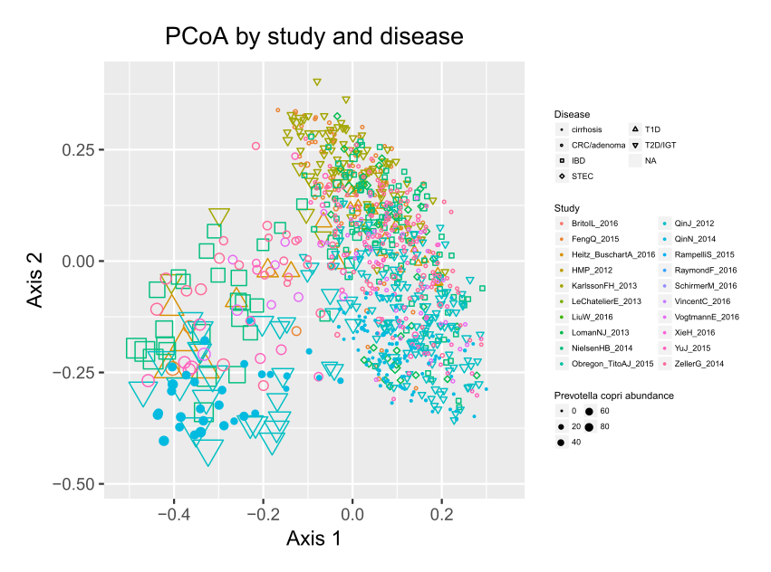

# Supplemental Figure 3. Clustering scores for enterotypes in gut WGS samples


```r
pam_bray <- sapply(2:10, function(i) pam(dist_bray, k = i, cluster.only = T))
pam_js <- sapply(2:10, function(i) pam(dist_js, k = i, cluster.only = T))
pam_rjs <- sapply(2:10, function(i) pam(dist_rjs, k = i, cluster.only = T))

plot_cluster_validation = function(bray, js, rjs, legend = T, ...) {
    plot(2:10, bray, type = "b", pch = 1, xlab = "Number of Clusters", ...)
    lines(2:10, js, type = "b", pch = 2, lty = 2)
    lines(2:10, rjs, type = "b", pch = 22, lty = 3)
    if (legend) {
        legend("topright", legend = c("Bray-Curtis", "Jensen-Shannon", "Root Jensen-Shannon"), pch = c(1, 2, 22), lty = 1:3)
    }
}

ch_bray <- apply(pam_bray, 2, function(i) cluster.stats(dist_bray, i)$ch)
ch_js <- apply(pam_js, 2, function(i) cluster.stats(dist_js, i)$ch)
ch_rjs <- apply(pam_rjs, 2, function(i) cluster.stats(dist_rjs, i)$ch)

plot_cluster_validation(ch_bray, ch_js, ch_rjs, legend = T, ylab = "Calinski-Harabasz score", ylim = c(0, 450))

si_bray <- apply(pam_bray, 2, function(i) mean(silhouette(i, dist_bray)[, 3]))
si_js <- apply(pam_js, 2, function(i) mean(silhouette(i, dist_js)[, 3]))
si_rjs <- apply(pam_rjs, 2, function(i) mean(silhouette(i, dist_rjs)[, 3]))

plot_cluster_validation(si_bray, si_js, si_rjs, legend = F, ylab = "Average silhouette width", ylim = c(0, 1))
abline(0.75, 0, lty = 5, col = darkGray)
abline(0.5, 0, lty = 5, col = darkGray)
abline(0.25, 0, lty = 5, col = darkGray)
text("Strong support", x = 9, y = 0.8, col = darkGray)
text("Moderate support", x = 9, y = 0.6, col = darkGray)
text("Weak and could be artificial", x = 8.5, y = 0.4, col = darkGray)
text("No substantial structure", x = 8.5, y = 0.2, col = darkGray)

ps_bray <- prediction.strength(dist_bray, Gmin = 2, Gmax = 10, clustermethod = pamkCBI)
ps_js <- prediction.strength(dist_js, Gmin = 2, Gmax = 10, clustermethod = pamkCBI)
ps_rjs <- prediction.strength(dist_rjs, Gmin = 2, Gmax = 10, clustermethod = pamkCBI)

plot_cluster_validation(ps_bray$mean.pred[2:10], ps_js$mean.pred[2:10], ps_rjs$mean.pred[2:10], ylab = "Prediction Strength", ylim = c(0, 1.1), legend = F)
abline(0.9, 0, lty = 5, col = darkGray)
abline(0.8, 0, lty = 8, col = darkGray)
text("Strong support", x = 9, y = 1, col = darkGray)
text("Moderate support", x = 9, y = 0.85, col = darkGray)
text("Little or no support", x = 9, y = 0.6, col = darkGray)
```

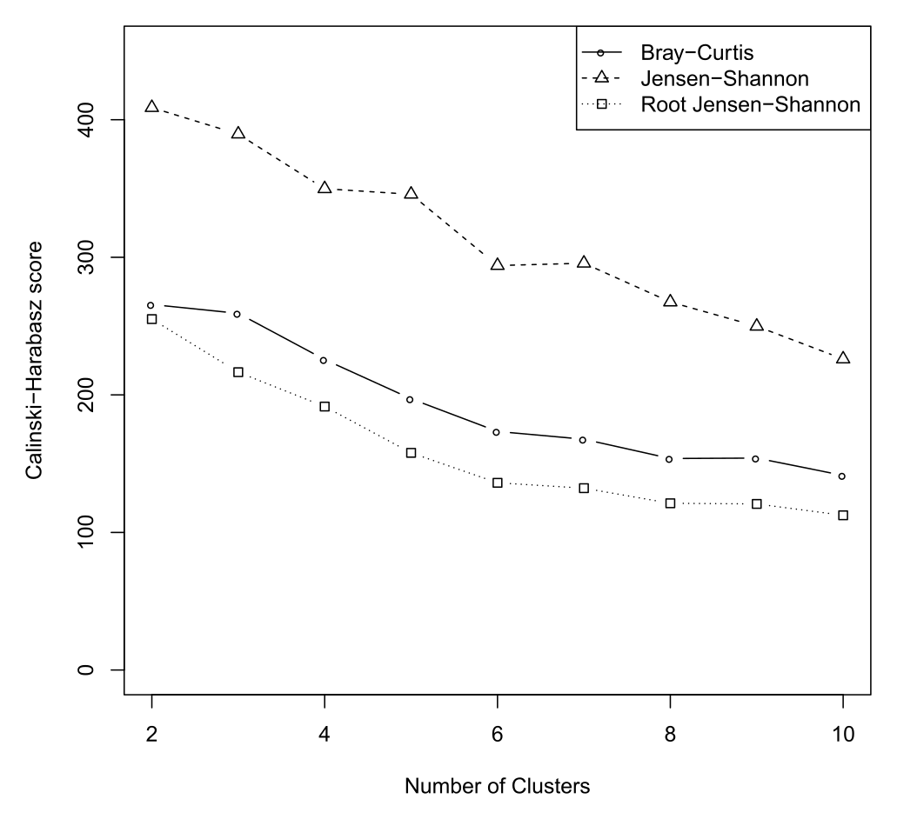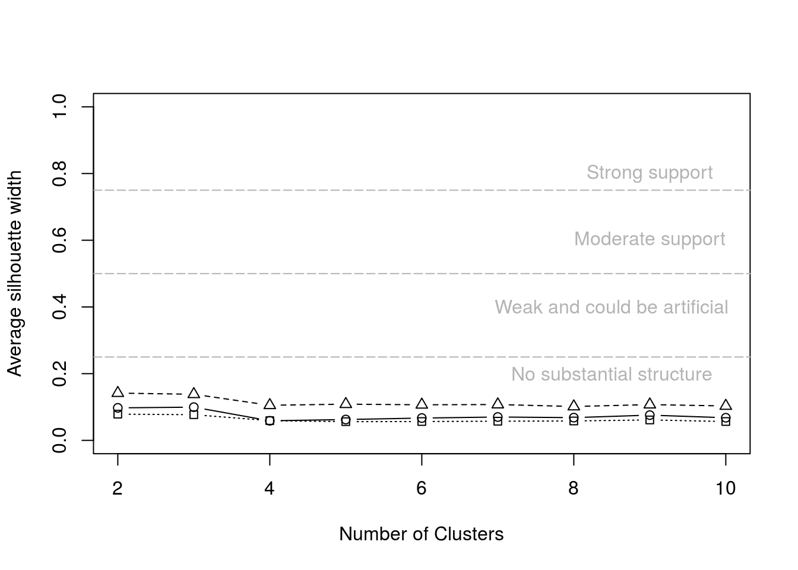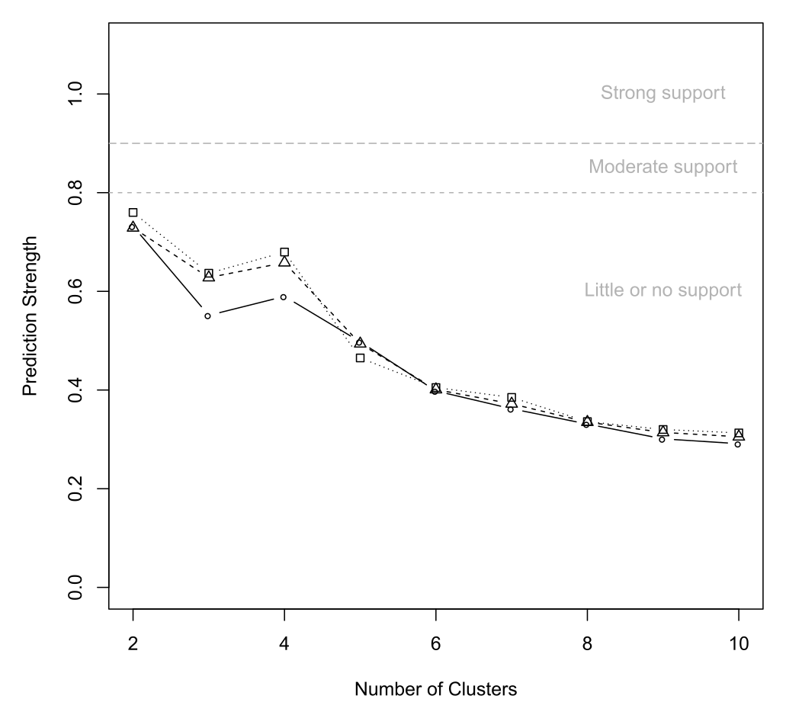

# Supplemental Figure 4: Top correlations between metabolic pathways and genera


```r
## update
eh <- ExperimentHub()
myquery <- query(eh, "curatedMetagenomicData")
version <- "20170526."

myquery.stool <- myquery[grepl("stool", myquery$title) & grepl("pathabundance", myquery$title) & grepl(version, myquery$title) & !grepl("VatanenT_2016", myquery$title) & !grepl("AsnicarF_2017", myquery$title), ]

eset.list <- lapply(names(myquery.stool), function(x) myquery.stool[[x]])

names(eset.list) <- gsub("-", "_", gsub(version, "", myquery.stool$title))

for (i in 1:length(eset.list)) {
    colnames(eset.list[[i]]) <- paste(names(eset.list)[[i]], colnames(eset.list[[i]]), sep = ".")
    pData(eset.list[[i]]) <- pData(eset.list[[i]])[,!sapply(pData(eset.list[[i]]), function(x) all(is.na(x)))]
    eset.list[[i]]$subjectID <- as.character(eset.list[[i]]$subjectID)
}

for (i in seq_along(eset.list)) {
    eset.list[[i]] <- eset.list[[i]][!grepl("\\|", rownames(eset.list[[i]])), ]
}

pdat <- joinWithRnames(eset.list, FUN = pData)
pdat$study <- sub("\\..+", "", rownames(pdat))
ab <- joinWithRnames(eset.list, FUN = exprs)
ab[is.na(ab)] <- 0
eset_pathway <- ExpressionSet(assayData = as.matrix(ab), phenoData = AnnotatedDataFrame(pdat))

myquery.stool <- myquery[grepl("stool", myquery$title) & grepl("bugs", myquery$title) & grepl(version, myquery$title) & !grepl("VatanenT_2016", myquery$title) & !grepl("AsnicarF_2017", myquery$title), ]

eset.list <- lapply(names(myquery.stool), function(x) myquery.stool[[x]])

names(eset.list) <- gsub("-", "_", gsub(version, "", myquery.stool$title))

for (i in 1:length(eset.list)) {
    colnames(eset.list[[i]]) <- paste(names(eset.list)[[i]], colnames(eset.list[[i]]), sep = ".")
    pData(eset.list[[i]]) <- pData(eset.list[[i]])[,!sapply(pData(eset.list[[i]]), function(x) all(is.na(x)))]
    eset.list[[i]]$subjectID <- as.character(eset.list[[i]]$subjectID)
}

for (i in seq_along(eset.list)) {
    eset.list[[i]] <- eset.list[[i]][grep("t__", rownames(eset.list[[i]]), invert = TRUE),]
    eset.list[[i]] <- eset.list[[i]][grep("s__|_unclassified", rownames(eset.list[[i]]), perl = TRUE),]
}

pdat <- joinWithRnames(eset.list, FUN = pData)
pdat$study <- sub("\\..+", "", rownames(pdat))
ab <- joinWithRnames(eset.list, FUN = exprs)
ab[is.na(ab)] <- 0
eset_bugs <- ExpressionSet(assayData = as.matrix(ab), phenoData = AnnotatedDataFrame(pdat))

pseq <- metaphlanToPhyloseq(tax = exprs(eset_bugs), metadat = pData(eset_bugs), split = ".")

glom_genus <- tax_glom(pseq, taxrank = "Genus")
top20_genus_otu_names = names(sort(taxa_sums(glom_genus), TRUE)[1:20])
top20_genus <- tax_table(glom_genus)[top20_genus_otu_names,"Genus"]
subset_genus <- prune_taxa(top20_genus_otu_names, glom_genus)

max_cor_pathway <- function(y, X, margin=1) {
  cors = apply(X, margin, function(x) cor.test(as.numeric(y), as.numeric(x))$estimate)
  rownames(X)[cors==max(cors, na.rm=TRUE)]
}

exprs_pwy <- exprs(eset_pathway)
exprs_pwy <- exprs_pwy[apply(exprs_pwy, 1, function(i) max(i) != 0), ]

max_pathways <- apply(otu_table(subset_genus), 1,  function(y) max_cor_pathway(y, X=exprs_pwy))

cor_matrix <- cor(t(otu_table(subset_genus)), t(exprs(eset_pathway)[max_pathways,]))
rownames(cor_matrix) = top20_genus[rownames(cor_matrix), 1]
colnames(cor_matrix) = gsub(".", " ", gsub("..", " - ", colnames(cor_matrix), fixed=TRUE), fixed=TRUE)

melted_cors <- melt(cor_matrix)
melted_cors %>%
    ggplot(aes(x=Var1, y=Var2, fill=value)) +
    geom_tile() +
    coord_fixed() +
    scale_fill_gradient2(low = blueGreen, high = purple, mid = gray,
     midpoint = 0, space = "Lab",
     name="Pearson\nCorrelation") +
    theme(axis.text.x = element_text(angle = 45, vjust=1, hjust=1, size=6), axis.text.y=element_text(size=6), 
     legend.text = element_text(size=6) ) +
    labs(x = "Genus", y = "Pathway")
```

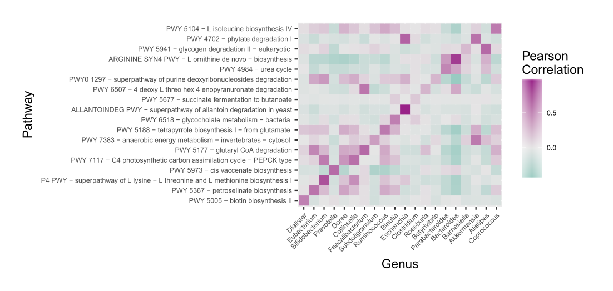

# Supplemental Figure 5: Alpha diversity from 22 gut studies


```r
## update
eh <- ExperimentHub()
myquery <- query(eh, "curatedMetagenomicData")
version <- "20170526."

myquery.stool <- myquery[grepl("stool", myquery$title) & grepl("bugs", myquery$title) & grepl(version, myquery$title), ]

eset.list <- lapply(names(myquery.stool), function(x) myquery.stool[[x]])

names(eset.list) <- gsub("-", "_", gsub(version, "", myquery.stool$title))

for (i in 1:length(eset.list)) {
    colnames(eset.list[[i]]) <- paste(names(eset.list)[[i]], colnames(eset.list[[i]]), sep = ".")
    pData(eset.list[[i]]) <- pData(eset.list[[i]])[, !sapply(pData(eset.list[[i]]), function(x) all(is.na(x)))]
    eset.list[[i]]$subjectID <- as.character(eset.list[[i]]$subjectID)
}

for (i in seq_along(eset.list)) {
    eset.list[[i]] <- eset.list[[i]][grep("t__", rownames(eset.list[[i]]), invert = TRUE), ]
    eset.list[[i]] <- eset.list[[i]][grep("s__|_unclassified", rownames(eset.list[[i]]), perl = TRUE), ]
}

pdat <- joinWithRnames(eset.list, FUN = pData)
pdat$study <- sub("\\..+", "", rownames(pdat))
ab <- joinWithRnames(eset.list, FUN = exprs)
ab[is.na(ab)] <- 0
eset <- ExpressionSet(assayData = as.matrix(ab), phenoData = AnnotatedDataFrame(pdat))

## update
pseq <- metaphlanToPhyloseq(tax = exprs(eset), metadat = pData(eset), split = ".")

alpha <- estimate_richness(pseq, measures = "Shannon")
alpha$study <- sample_data(pseq)$study

alpha %<>%
    group_by(study) %>%
    mutate(median = median(Shannon)) %>%
    arrange(desc(median)) %>%
    ungroup %>%
    mutate(study_num = as.numeric(as.factor(alpha$study)))

box_order <- factor(unique(alpha$study[order(alpha$median)]))

alpha$study <- factor(alpha$study, levels = box_order)

alpha %>%
    ggplot(aes(x = study, y = Shannon, fill = study)) +
    stat_boxplot(geom = "errorbar") +
    geom_boxplot() +
    theme(axis.text.x = element_blank(), axis.ticks.x = element_blank()) +
    guides(fill = guide_legend(title="Study")) +
    labs(x = "", y = "Shannon Alpha Diversity") +
    scale_fill_manual(values = c(pallet[1:11], pallet[1:11]))
```

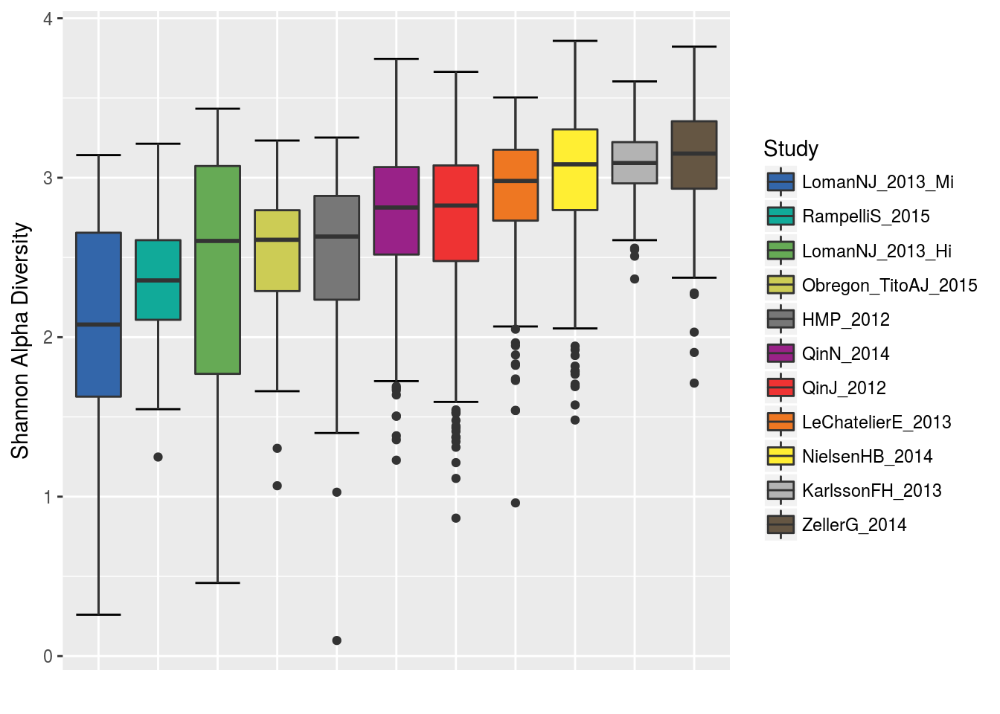

# Session Info

```r
sessionInfo()
```

```
## R version 3.4.0 RC (2017-04-20 r72569)
## Platform: x86_64-pc-linux-gnu (64-bit)
## Running under: Ubuntu 16.04.2 LTS
## 
## Matrix products: default
## BLAS: /usr/lib/atlas-base/atlas/libblas.so.3.0
## LAPACK: /usr/lib/atlas-base/atlas/liblapack.so.3.0
## 
## locale:
##  [1] LC_CTYPE=en_US.UTF-8       LC_NUMERIC=C              
##  [3] LC_TIME=en_US.UTF-8        LC_COLLATE=en_US.UTF-8    
##  [5] LC_MONETARY=en_US.UTF-8    LC_MESSAGES=en_US.UTF-8   
##  [7] LC_PAPER=en_US.UTF-8       LC_NAME=C                 
##  [9] LC_ADDRESS=C               LC_TELEPHONE=C            
## [11] LC_MEASUREMENT=en_US.UTF-8 LC_IDENTIFICATION=C       
## 
## attached base packages:
## [1] parallel  stats     graphics  grDevices utils     datasets  methods  
## [8] base     
## 
## other attached packages:
##  [1] doMC_1.3.4                   iterators_1.0.8             
##  [3] foreach_1.4.3                phyloseq_1.21.0             
##  [5] reshape2_1.4.2               RColorBrewer_1.1-2          
##  [7] fpc_2.1-10                   gclus_1.3.1                 
##  [9] cluster_2.0.6                pROC_1.9.1                  
## [11] caret_6.0-76                 ggplot2_2.2.1               
## [13] lattice_0.20-35              randomForest_4.6-12         
## [15] curatedMetagenomicData_1.3.3 ExperimentHub_1.3.0         
## [17] AnnotationHub_2.9.3          Biobase_2.37.2              
## [19] BiocGenerics_0.23.0          dplyr_0.5.0                 
## 
## loaded via a namespace (and not attached):
##  [1] nlme_3.1-131                  pbkrtest_0.4-7               
##  [3] httr_1.2.1                    rprojroot_1.2                
##  [5] prabclus_2.2-6                tools_3.4.0                  
##  [7] backports_1.1.0               vegan_2.4-3                  
##  [9] R6_2.2.1                      DBI_0.6-1                    
## [11] lazyeval_0.2.0                mgcv_1.8-17                  
## [13] colorspace_1.3-2              permute_0.9-4                
## [15] ade4_1.7-6                    trimcluster_0.1-2            
## [17] nnet_7.3-12                   compiler_3.4.0               
## [19] quantreg_5.33                 SparseM_1.77                 
## [21] diptest_0.75-7                scales_0.4.1                 
## [23] DEoptimR_1.0-8                mvtnorm_1.0-6                
## [25] robustbase_0.92-7             stringr_1.2.0                
## [27] digest_0.6.12                 minqa_1.2.4                  
## [29] rmarkdown_1.5                 XVector_0.17.0               
## [31] htmltools_0.3.6               lme4_1.1-13                  
## [33] rlang_0.1.1                   RSQLite_1.1-2                
## [35] BiocInstaller_1.27.2          shiny_1.0.3                  
## [37] jsonlite_1.5                  mclust_5.3                   
## [39] ModelMetrics_1.1.0            car_2.1-4                    
## [41] magrittr_1.5                  modeltools_0.2-21            
## [43] biomformat_1.5.0              Matrix_1.2-10                
## [45] Rcpp_0.12.11                  munsell_0.4.3                
## [47] S4Vectors_0.15.3              ape_4.1                      
## [49] stringi_1.1.5                 yaml_2.1.14                  
## [51] MASS_7.3-47                   zlibbioc_1.23.0              
## [53] flexmix_2.3-14                rhdf5_2.21.1                 
## [55] plyr_1.8.4                    grid_3.4.0                   
## [57] Biostrings_2.45.2             splines_3.4.0                
## [59] multtest_2.33.0               knitr_1.16                   
## [61] igraph_1.0.1                  codetools_0.2-15             
## [63] stats4_3.4.0                  evaluate_0.10                
## [65] data.table_1.10.4             nloptr_1.0.4                 
## [67] httpuv_1.3.3                  MatrixModels_0.4-1           
## [69] gtable_0.2.0                  tidyr_0.6.3                  
## [71] kernlab_0.9-25                assertthat_0.2.0             
## [73] mime_0.5                      xtable_1.8-2                 
## [75] class_7.3-14                  survival_2.41-3              
## [77] tibble_1.3.3                  AnnotationDbi_1.39.1         
## [79] memoise_1.1.0                 IRanges_2.11.3               
## [81] interactiveDisplayBase_1.15.0
```
